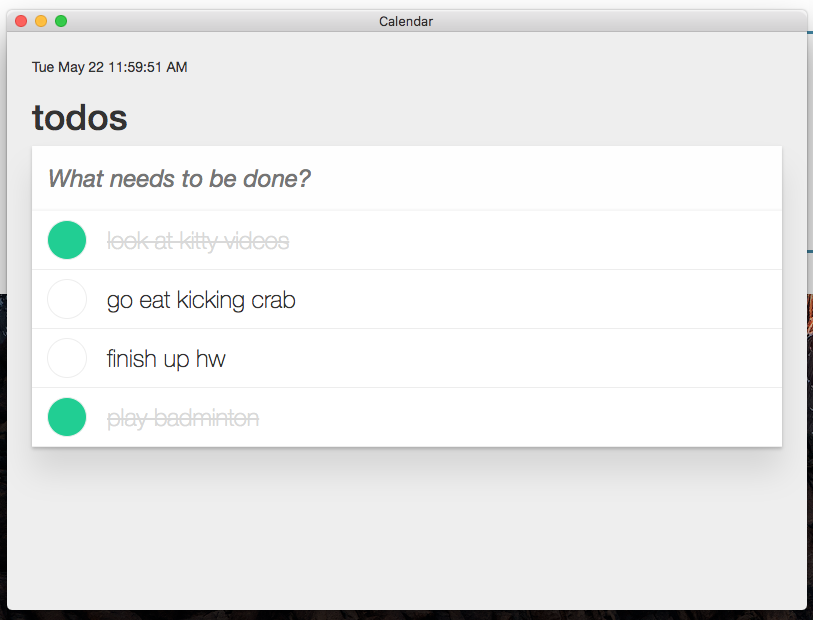

# Kim & Trang's Desktop Calendar App

Download the [MacOS app here.](https://github.com/kim-nguyenkhn/kim-trang-calendar/releases/download/v1.0.0/kim-trang-calendar-darwin-x64.zip)

<kbd></kbd>

Built with ❤️ using [Electron](https://electronjs.org/).

## Getting Started

The first thing to do is install Node.js, if you haven't already. The easiest
way to do that is by visiting [nodejs.org](https://nodejs.org) and downloading
the installer, which will set up `node` and `npm` for you.

Once you've got that out of the way, clone the repository. If you're new to
git, check out the
[guide to cloning a repository](https://help.github.com/articles/cloning-a-repository/).

```sh
git clone https://github.com/kim-nguyenkhn/kim-trang-calendar.git
cd kim-trang-calendar
npm install
npm start
```

## Next Steps

- Add a timestamp/due date to the todo items
- Convert everything to React components
- Have some integration with Google Calendar, or iCal