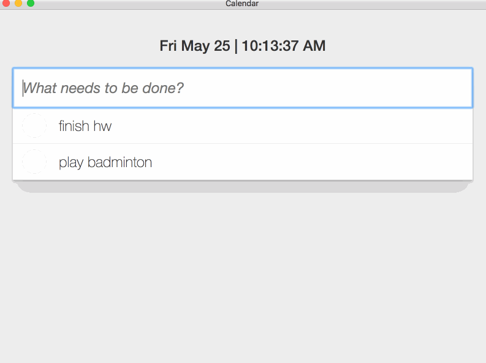

# Kim & Trang's Desktop Calendar App

Download the [MacOS app here.](https://github.com/kim-nguyenkhn/kim-trang-calendar/releases/download/v1.0.1/kim-trang-calendar.app.zip)

<kbd></kbd>

Built with ❤️ using [Electron](https://electronjs.org/), and [Electron Packager](https://github.com/electron-userland/electron-packager).

## Getting Started

The first thing to do is install Node.js, if you haven't already. The easiest
way to do that is by visiting [nodejs.org](https://nodejs.org) and downloading
the installer, which will set up `node` and `npm` for you.

Once you've got that out of the way, clone the repository. If you're new to
git, check out the
[guide to cloning a repository](https://help.github.com/articles/cloning-a-repository/).

```sh
git clone https://github.com/kim-nguyenkhn/kim-trang-calendar.git
cd kim-trang-calendar
npm install
npm start
```

## Using Electron-Packager to Cut Releases

Run this in the root directory:

```
electron-packager .
```

`electron-packager` will do the following:

* Use the current directory for the `sourcedir`
* Infer the `appname` from the `productName` in `package.json`
* Infer the `appVersion` from the `version` in `package.json`
* Infer the `platform` and `arch` from the host, in this example, `darwin` platform and `x64` arch.
* Download the darwin x64 build of Electron 1.4.15 (and cache the downloads in `~/.electron`)
* Build the OS X `Foo Bar.app`
* Place `Foo Bar.app` in `foobar/Foo Bar-darwin-x64/` (since an `out` directory was not specified, it used the current working directory)

The `Foo Bar.app` folder generated can be executed by a system running OS X, which will start the packaged Electron app. This is also true of the Windows x64 build on a system running a new enough version of Windows for a 64-bit system (via `Foo Bar-win32-x64/Foo Bar.exe`), and so on.

See more on Electron Packager [here](https://github.com/electron-userland/electron-packager).

## Next Steps

- Add a timestamp/due date to the todo items
- Convert everything to React components
- Have some integration with Google Calendar, or iCal